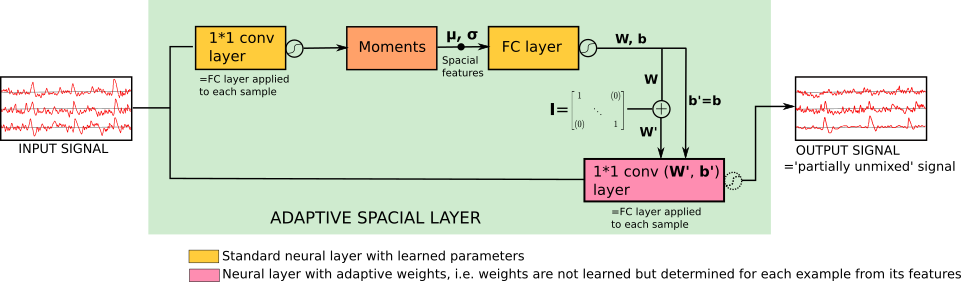
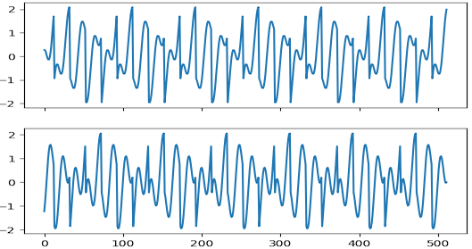

## Neural ICA

This repository provides a simple toy example of neural ICA, i.e ICA embedded in neural network layers. The basic building block is an adaptive channel recomposition Layer. We call it 'Adaptive Spacial layer' because we developped it for EEG analysis where channels are spread over space. Of course it can also be used when channels have no notion of 'space'. 

## The Adaptive Spacial Layer

see `model.AdaptiveSpacialLayer`. 
An adaptive spatial layer applies adaptive weights to its input channels and returns transformed channels. The weights depend on the input, i.e. each element of a training minibatch uses a different set of weights. Weights are determined based on spacial features of the input obtained with fully connected layers as in [TCL](https://arxiv.org/abs/1605.06336). All time samples of a same example are transformed with the same weights. (an extension for _non-factorized_ spatio-temporal analysis could be to use evolving weights...) 

## The Multilayer Adaptive Spatial Net

A multilayer adaptive spatial net is obtained by stacking such adaptive spacial layers (linearly or non-linearly). Here we present a linear stack, i.e. the unmixing is in each adaptive layer is linear. But spacial features used to determine adaptive weights are non-linear. The net is trained with an _ICA cost_, i.e. it is trained to maxime the non-gaussianity and asymetry of its output. 

`ica_poc_train.py` shows a basic proof of concept on toy signals mixed with random coefficients. A training time, many mixed examples (all with different mixing coefficients) are presented. After training, the network is able to separate sources _in a single forward pass_. 

Mixed signals:

Unmixed signals:

## Other analyses based on costatistics between channels

Note that whilst here for a simple first application we trained the system to perform ICA, it can also be used for other purposes. For example in a spatiotemporal analysis system it can be used as a first spacial analysis brick, followed by a temporal analysis brick, for example temporal CNNs. The whole system can be trained with backprop and the Spacial Analysis Layer will recompose input channels into channels that are the most suitable for the subsequent temporal analysis. We expect that non-linear recomposition is also possible. 